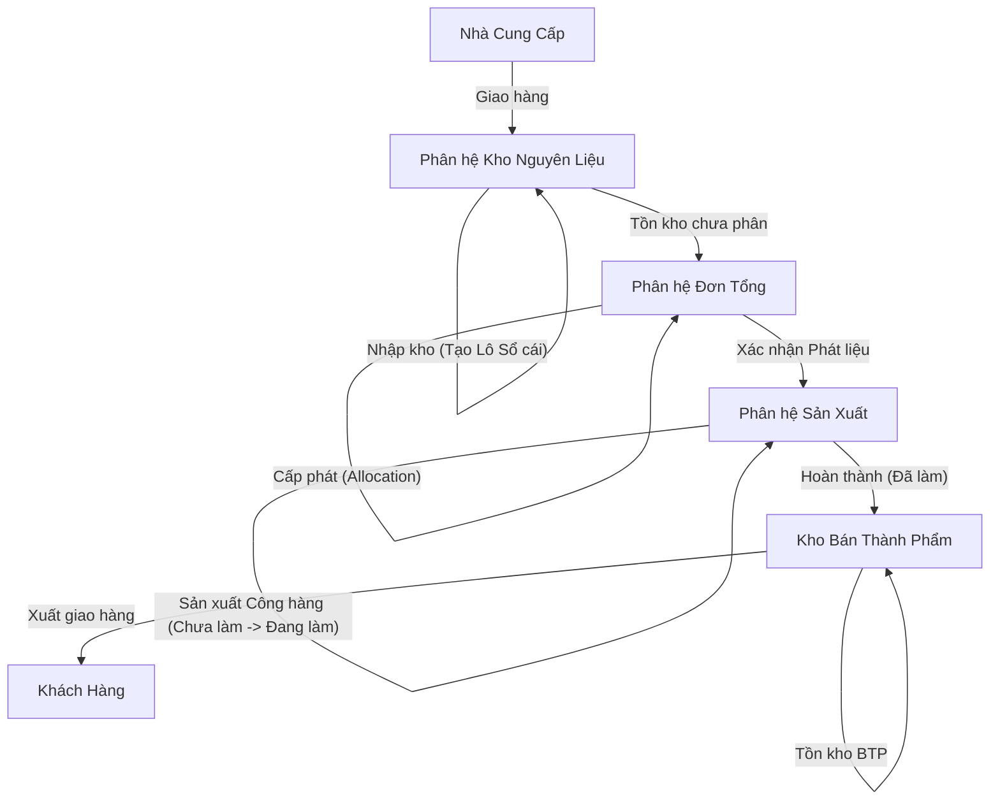
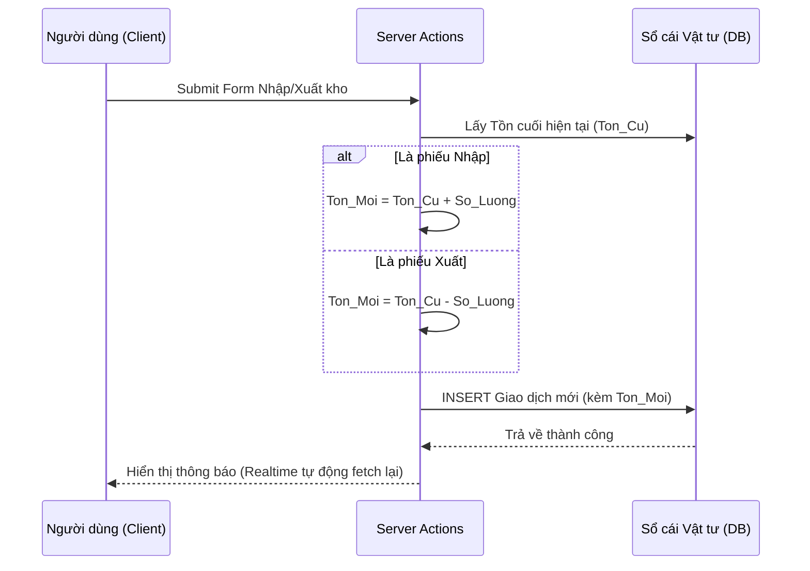
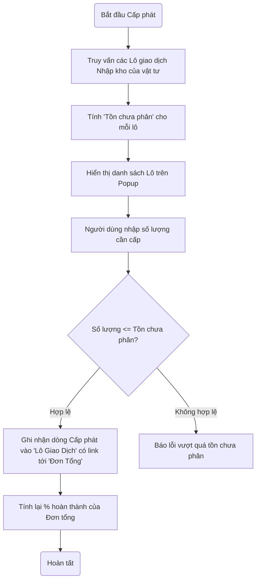
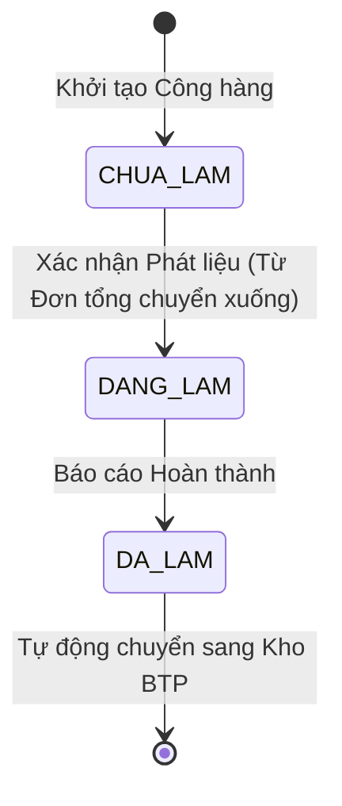
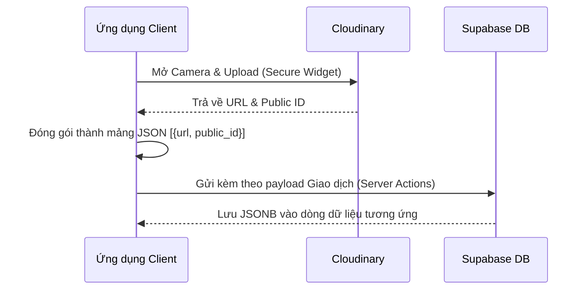

# Luồng Logic và Tương tác Phân hệ (System Logic & Modules)

Tài liệu này tập trung giải thích **luồng truyền tải dữ liệu, logic nghiệp vụ** và cách các phân hệ trong hệ thống tương tác với nhau.

---

## 1. Sơ đồ Luồng Hoạt động Tổng thể (Global Workflow)

Hệ thống quản lý vòng đời của vật tư từ lúc nhập kho nguyên liệu cho đến khi xuất thành phẩm (Kho Bán Thành Phẩm). Dưới đây là sơ đồ phối hợp giữa 4 module chính: Kho -> Đơn Tổng -> Sản Xuất -> BTP.

---

## 2. Chi tiết Logic: Phân hệ Kho Nguyên Liệu

**Mục tiêu:** Quản lý nhập/xuất vật tư theo lô (batch-tracking) đảm bảo truy xuất nguồn gốc chính xác.

### Thuật toán Cập nhật Tồn kho
Hệ thống sử dụng cơ chế **Sổ cái (Ledger)**. Mọi thao tác đều tạo ra một record (Giao dịch) mới với số dư cuối (`so_luong_ton_cuoi`).
- Tránh việc tính toán `SUM(nhap) - SUM(xuat)` mỗi lần lấy tồn kho.
- Lấy tồn kho hiện tại chỉ bằng cách truy vấn Record mới nhất của mỗi vật tư: `DISTINCT ON (nguyen_lieu_id) ... ORDER BY created_at DESC`.

---

## 3. Chi tiết Logic: Phân hệ Đơn Tổng (Master Orders)

**Mục tiêu:** Phân bổ vật tư tồn kho cho các kế hoạch sản xuất cụ thể. Giúp quản lý xem Đơn tổng này đã gom đủ vật tư để tiến hành sản xuất chưa.

### Thuật toán Số dư Động (Tồn chưa phân)
Một Lô Nhập Kho có số lượng X. Khi rót vào Đơn tổng 1 lượng Y, hệ thống không trừ trực tiếp vào Tồn kho (vì hàng vẫn nằm trong kho), mà ghi nhận một liên kết `Lô Giao Dịch` <-> `Đơn Tổng Chi Tiết`.
`Tồn chưa phân của Lô` = `Số lượng Lô` - `SUM(Các lần đã cấp phát cho mọi Đơn tổng)`.

---

## 4. Chi tiết Logic: Phân hệ Sản Xuất

**Mục tiêu:** Quản lý vòng đời chế tạo của từng **Công hàng** (Mã hàng sản xuất cụ thể).

---

## 5. Luồng Xử lý Đa phương tiện (Media Upload)

Tất cả các giao dịch (Nhập/Xuất, Chuyển trạng thái) đều yêu cầu hình ảnh minh chứng. Dữ liệu ảnh được lưu trực tiếp vào trường JSONB trong Database để tránh việc tạo bảng phụ cồng kềnh.

