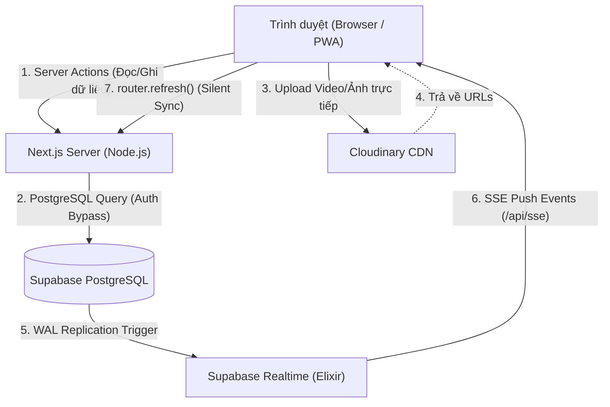

# Kiến trúc Dự án & Tech Stack

Tài liệu này phân tích các quyết định về kiến trúc và công nghệ được lựa chọn để xây dựng ITKeyBay, tập trung vào hiệu năng, trải nghiệm thời gian thực và khả năng mở rộng.

---

## 1. Tổ hợp Công nghệ (Tech Stack)

- **Frontend & Meta-Framework:** Next.js 16 (App Router) + React 19.
- **Ngôn ngữ:** TypeScript (Strict Mode).
- **Backend & Cơ sở dữ liệu:** Supabase (PostgreSQL 15+).
- **Quản lý Trạng thái Global:** Zustand & Server Actions.
- **Xác thực:** Custom JWT Auth (Middleware chặn route).
- **Xử lý Đa phương tiện:** Cloudinary (`next-cloudinary`).
- **Giao diện:** Tailwind CSS v4, Shadcn/UI (Radix-UI).

---

## 2. Các Mẫu Kiến trúc (Architectural Patterns)

### 2.1. Kiến trúc Server Actions & SSR
- **Bỏ qua RLS (Row Level Security):** Thay vì truy vấn trực tiếp từ Client bằng Supabase JS, toàn bộ dữ liệu đi qua **Server Actions** (`/src/app/actions`).
- Điều này bảo mật hoàn toàn API Key, đồng thời giảm lượng JS bundle tải xuống trình duyệt. Client chỉ nhận JSON hoặc HTML đã render sẵn.

### 2.2. Cơ chế Đồng bộ Thời gian thực Ngầm (Silent Background Realtime SSE)
- Hệ thống cần cập nhật dữ liệu tự động giữa nhiều thiết bị trong xưởng (Ví dụ: Thủ kho nhập hàng, người quản lý thấy tồn kho tăng ngay lập tức).
- **Giải pháp:** 
  - Tạo một cổng SSE duy nhất tại `/api/sse`.
  - Component `<RealtimeProvider>` bọc ngoài Layout, lắng nghe kênh `postgres_changes` của Supabase.
  - Khi có thay đổi, Provider gọi `router.refresh()` ngầm. Không có popup Toast gây phiền hà, không làm mất tiêu điểm (focus) nhập liệu của người dùng.

### 2.3. Tối ưu Hiệu suất Cơ sở Dữ liệu bằng PostgreSQL View O(1)
- **Vấn đề cũ:** API phải kéo hàng loạt dòng giao dịch (giới hạn 1000 rows của Supabase) về Node.js để lặp (loop) và tính tồn kho. Khi dữ liệu lớn, việc này gây nghẽn cổ chai và sai lệch số liệu.
- **Giải pháp mới:** Triển khai trực tiếp logic tính tồn kho xuống tầng Database thông qua View `view_ton_kho_hien_tai`.
  - Sử dụng lệnh `DISTINCT ON (nguyen_lieu_id)` kết hợp `ORDER BY created_at DESC`.
  - Database lấy chính xác 1 dòng dữ liệu giao dịch mới nhất cho mỗi vật tư (nơi chứa số dư tồn cuối cùng). Trả kết quả với độ phức tạp **O(1)**.

### 2.4. Client-Side Localization (Đa ngôn ngữ siêu tốc)
- Hỗ trợ 3 ngôn ngữ: Tiếng Việt, Tiếng Anh, Tiếng Trung.
- Quản lý từ điển qua các file JSON tĩnh (`/src/i18n/vi.json`, v.v.).
- State ngôn ngữ lưu trong Zustand, inject trực tiếp vào giao diện (Client Components) mà không làm tải lại trang (No page reload), đảm bảo phản hồi ngay lập tức (Instant feedback).

---

## 3. Sơ đồ Kiến trúc Tổng thể

