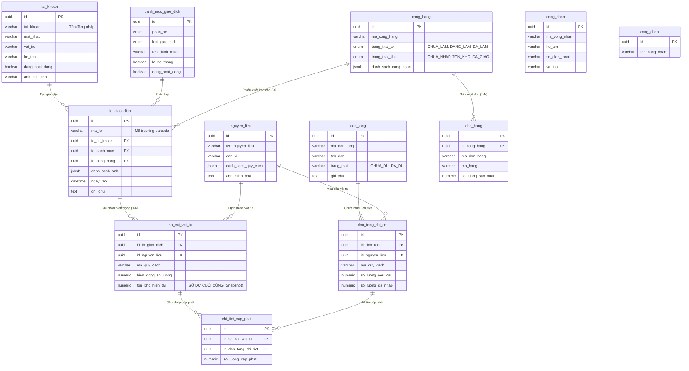

# Sơ đồ Cơ sở dữ liệu và Mô hình Phối hợp (Database Schema)

Tài liệu này giải thích chi tiết cấu trúc các bảng (Tables) hiện tại trên môi trường Production, các quan hệ (Relationships), và cách chúng phối hợp thành các nhóm (Groups) để giải quyết bài toán nghiệp vụ lõi (Kho, Đơn Tổng, Sản xuất).

---

## 1. Sơ đồ Quan hệ Thực thể (ERD Toàn Hệ Thống)

Sơ đồ dưới đây thể hiện toàn bộ **12 bảng** hiện có trong hệ thống và các mối liên kết.

---

## 2. Giải thích Sự phối hợp Dữ liệu (Module Coordination)

Cơ sở dữ liệu được thiết kế theo tư tưởng **Sổ cái (Ledger-based)** chuẩn mực, tách bạch hoàn toàn việc lưu trữ biến động kho và việc phân bổ cho chiến dịch sản xuất.

### Nhóm 1: Nhóm Dữ liệu Kho Nguyên Liệu (`nguyen_lieu`, `danh_muc_giao_dich`, `lo_giao_dich`, `so_cai_vat_tu`)
- **Nguyên lý hoạt động:** Bất cứ khi nào vật tư di chuyển ra/vào kho, một `lo_giao_dich` (Đại diện cho Phiếu nhập/xuất) được tạo ra. Kèm theo đó, hệ thống chèn (INSERT) các dòng vào `so_cai_vat_tu` tương ứng với từng vật tư trong lô.
- **Tính năng Chốt sổ (Snapshot):** Cột `ton_kho_hien_tai` trong bảng Sổ cái lưu lại số dư tồn kho **ngay tại thời điểm giao dịch hoàn tất**. Nhờ vậy, ta không bao giờ phải chạy lệnh `SUM()` toàn bộ lịch sử để tìm tồn kho hiện tại.

### Nhóm 2: Nhóm Dữ liệu Đơn Tổng & Cấp Phát (`don_tong`, `don_tong_chi_tiet`, `chi_tiet_cap_phat`)
- **Vai trò:** Lên danh sách định mức vật tư dự kiến cho một chiến dịch sản xuất (`don_tong_chi_tiet`).
- **Phối hợp cấp phát vật tư qua `chi_tiet_cap_phat`:** 
  - Hệ thống sử dụng một bảng trung gian chuẩn hóa `chi_tiet_cap_phat`. Bảng này làm cầu nối trực tiếp giữa **1 dòng sổ cái** (`id_so_cai_vat_tu`) và **1 yêu cầu vật tư** (`id_don_tong_chi_tiet`).
  - **Khi Cấp phát (Allocate):** Khi người dùng muốn rót vật tư, họ thực chất đang trích xuất từ một Lô cụ thể (tức là một dòng trong `so_cai_vat_tu`). Hệ thống ghi nhận số lượng trích xuất vào `so_luong_cap_phat`.
  - **Tính Tồn chưa phân:** Số lượng Tồn chưa phân của một dòng sổ cái bằng `bien_dong_so_luong` của nó trừ đi `SUM(so_luong_cap_phat)` trong bảng `chi_tiet_cap_phat` trỏ đến nó.
  - Cột `so_luong_da_nhap` trong `don_tong_chi_tiet` tự động phản ánh tổng số vật tư đã được cấp phát vào đó, giúp kiểm soát trạng thái Đơn tổng (`CHUA_DU` / `DA_DU`).

### Nhóm 3: Nhóm Sản xuất & Bán Thành Phẩm (`cong_hang`, `don_hang`, `cong_doan`, `cong_nhan`)
- **Mối liên hệ vòng đời:** Một công hàng có thể phục vụ nhiều đơn hàng (1 Công hàng - N Đơn hàng thông qua bảng `don_hang`).
- **Phối hợp theo dõi tiến độ:** 
  - Các công đoạn sản xuất như cưa, bào, sơn... có tính thứ tự và linh hoạt cao, do đó hệ thống áp dụng trường `danh_sach_cong_doan (JSONB)` trong `cong_hang`.
  - Trong mảng JSON này lưu trữ ai (`id_cong_nhan`) làm bước nào (`id_cong_doan`) và trạng thái (`da_xong`).
  - Khi xuất kho nguyên liệu để tiến hành sản xuất, `lo_giao_dich` mang giá trị `id_cong_hang` để kế toán truy vết được lượng vật tư này đã đổ vào công hàng nào.
