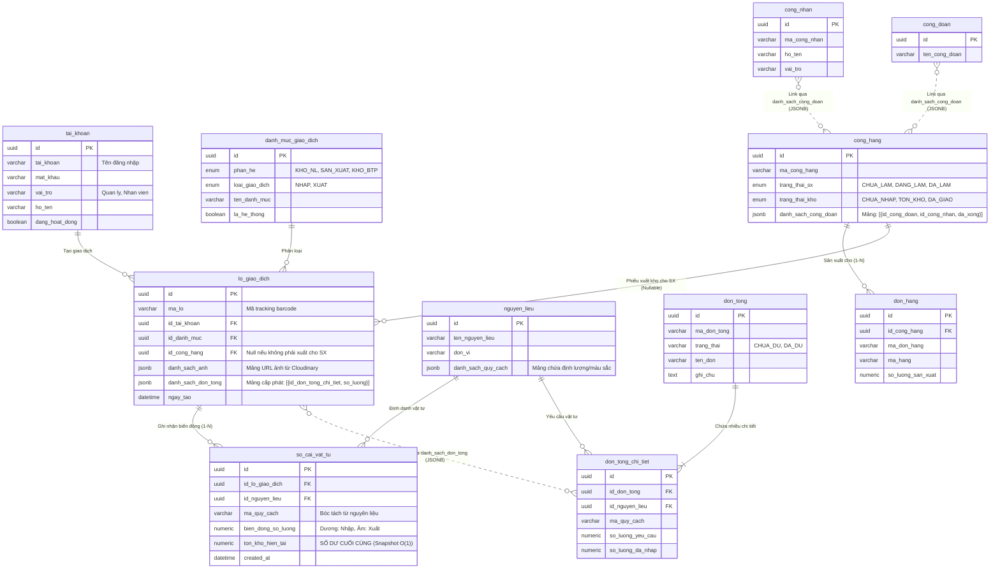

# Sơ đồ Cơ sở dữ liệu và Mô hình Phối hợp (Database Schema)

Tài liệu này giải thích chi tiết cấu trúc các bảng (Tables) hiện tại, các quan hệ (Relationships), và cách chúng phối hợp thành các nhóm (Groups) để giải quyết bài toán nghiệp vụ lõi (Kho, Đơn Tổng, Sản xuất).

---

## 1. Sơ đồ Quan hệ Thực thể (ERD Toàn Hệ Thống)

Sơ đồ dưới đây thể hiện toàn bộ **11 bảng** hiện có trong hệ thống và các mối liên kết (Foreign Keys & Logical Links) giữa chúng.

---

## 2. Giải thích Sự phối hợp Dữ liệu (Module Coordination)

Cơ sở dữ liệu được thiết kế theo tư tưởng "Sổ cái" (Ledger-based) kết hợp với lưu trữ phi cấu trúc một phần (JSONB) để tối ưu truy xuất.

### Nhóm 1: Nhóm Dữ liệu Kho Nguyên Liệu (`nguyen_lieu`, `danh_muc_giao_dich`, `lo_giao_dich`, `so_cai_vat_tu`)
- **Nguyên lý hoạt động:** Bất cứ khi nào vật tư di chuyển ra/vào kho, một `lo_giao_dich` (Đại diện cho Phiếu nhập/xuất) được tạo ra. Kèm theo đó, hệ thống chèn (INSERT) các dòng vào `so_cai_vat_tu` tương ứng với từng vật tư trong lô.
- **Tính năng Chốt sổ (Snapshot):** Cột `ton_kho_hien_tai` trong bảng Sổ cái lưu lại số dư tồn kho **ngay tại thời điểm giao dịch hoàn tất**. Nhờ vậy, ta không bao giờ phải chạy lệnh `SUM()` toàn bộ lịch sử để tìm tồn kho hiện tại.
- View PostgreSQL `view_ton_kho_hien_tai` chỉ cần lấy dòng Sổ cái có `created_at` mới nhất bằng lệnh `DISTINCT ON (id_nguyen_lieu, ma_quy_cach)`, mang lại **độ phức tạp O(1)** không đổi bất chấp số lượng giao dịch tăng lên hàng triệu dòng.

### Nhóm 2: Nhóm Dữ liệu Đơn Tổng (`don_tong`, `don_tong_chi_tiet`)
- **Vai trò:** Lên danh sách định mức vật tư dự kiến cho một chiến dịch sản xuất.
- **Phối hợp cấp phát vật tư:** 
  - Thay vì tạo một bảng n-n riêng lẻ, hệ thống sử dụng trường `danh_sach_don_tong (JSONB)` trực tiếp bên trong bảng `lo_giao_dich`.
  - **Khi người dùng Cấp phát (Allocate):** Lô giao dịch gốc sẽ được cập nhật trường JSONB này để ghi nhận: *"Lô này đã trích ra N kg vật tư để đưa vào id_don_tong_chi_tiet tương ứng"*.
  - **Tính Tồn chưa phân:** `so_luong` của Lô trừ đi tổng các giá trị trong mảng JSONB `danh_sach_don_tong`.
  - Cột `so_luong_da_nhap` trong `don_tong_chi_tiet` tự động tăng/giảm dựa trên các lần cấp phát/rút trả. Từ đó Đơn tổng tự động cập nhật trạng thái `DA_DU` khi nhập >= yêu cầu.

### Nhóm 3: Nhóm Sản xuất & Bán Thành Phẩm (`cong_hang`, `don_hang`, `cong_doan`, `cong_nhan`)
- **Mối liên hệ vòng đời:** Một công hàng có thể phục vụ nhiều đơn hàng (1 Công hàng - N Đơn hàng thông qua bảng `don_hang`).
- **Phối hợp theo dõi tiến độ:** 
  - Thay vì thiết kế bảng n-n rườm rà cho quy trình sản xuất (bởi vì các công đoạn sản xuất như cưa, bào, sơn... có tính thứ tự và linh hoạt cao), hệ thống áp dụng trường `danh_sach_cong_doan (JSONB)` trong `cong_hang`.
  - Trong mảng JSON này, nó lưu trữ ai (id_cong_nhan) làm bước nào (id_cong_doan) và trạng thái (da_xong).
  - Khi cần Xuất kho nguyên liệu xuống cho một công hàng sản xuất, `lo_giao_dich` sẽ mang giá trị `id_cong_hang` để kế toán dễ dàng truy vết vật tư này đang nằm ở công hàng nào.
