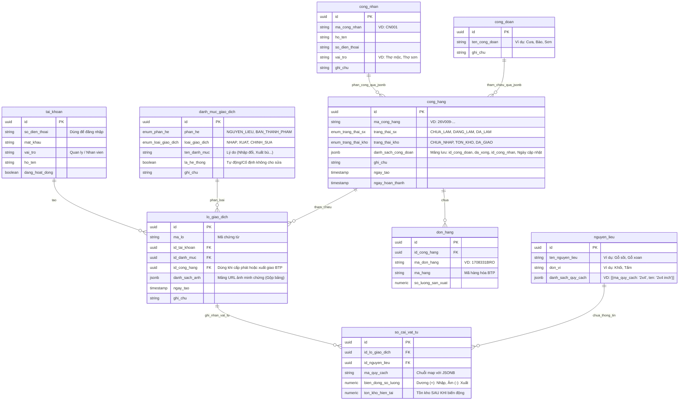

# Thiết kế Cơ sở Dữ liệu (Database Architecture)

Tài liệu này chứa cấu trúc CSDL để chúng ta cùng thảo luận, chỉnh sửa trước khi chốt kiến trúc cuối cùng.

## 1. Nguyên tắc thiết kế (Ledger-based & JSONB)
Thiết kế Sổ cái (Ledger) kết hợp lưu trữ số dư tồn kho tức thời sẽ áp dụng cho Kho Nguyên liệu. Đối với Bán thành phẩm và Quản lý Sản xuất, hệ thống tận dụng tối đa sức mạnh NoSQL của Postgres (cột JSONB) để gộp các bảng quan hệ phức tạp thành các mảng linh hoạt, giúp tốc độ truy xuất cực nhanh. Việc kiểm soát trạng thái được tiêu chuẩn hóa bằng các cấu trúc **ENUM**.

---

## 2. Sơ đồ Quan hệ Thực thể (ERD - Tiếng Việt Không Dấu)

---

## 3. Thảo luận & Open Questions (Dành cho bạn)

Kiến trúc Database này tập trung giải quyết:
- **Gộp giao dịch (Batch):** Một phiếu giao dịch (`lo_giao_dich`) đính kèm ảnh bằng JSONB, nhập/xuất n-quy cách nguyên liệu.
- **Tối giản Hóa Sản xuất:** Mảng `danh_sach_cong_doan` (JSONB) trong bảng Công hàng sẽ lưu trữ trực tiếp các liên kết (ID) tới bảng `cong_nhan` và `cong_doan` để theo dõi tiến độ một cách linh hoạt mà không cần tạo bảng trung gian khổng lồ.
- **Truy vết Kế toán:** Bảng `so_cai_vat_tu` ghi nhận sự tăng/giảm (+/-) và số dư tồn kho tại chính thời điểm đó.

**(Tất cả câu hỏi thảo luận đã được giải quyết!)**
