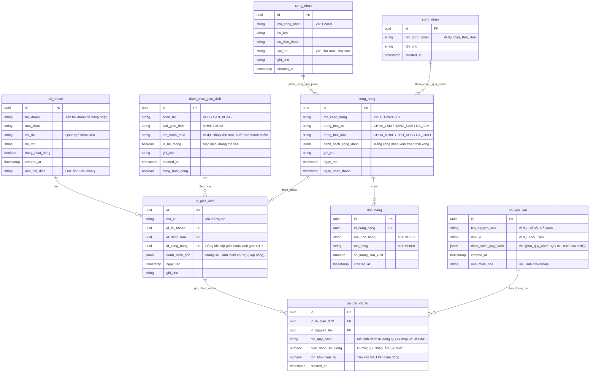

# Thiết kế Cơ sở Dữ liệu (Database Architecture)

Tài liệu này chứa cấu trúc CSDL để chúng ta cùng thảo luận, chỉnh sửa trước khi chốt kiến trúc cuối cùng.

## 1. Nguyên tắc thiết kế (Ledger-based & JSONB)
Thiết kế Sổ cái (Ledger) kết hợp lưu trữ số dư tồn kho tức thời sẽ áp dụng cho Kho Nguyên liệu. Đối với Bán thành phẩm và Quản lý Sản xuất, hệ thống tận dụng tối đa sức mạnh NoSQL của Postgres (cột JSONB) để gộp các bảng quan hệ phức tạp thành các mảng linh hoạt, giúp tốc độ truy xuất cực nhanh. Việc kiểm soát trạng thái được tiêu chuẩn hóa bằng các cấu trúc **ENUM**.

---

## 2. Sơ đồ Quan hệ Thực thể (ERD - Tiếng Việt Không Dấu)

```mermaid
erDiagram
    %% ==========================================
    %% 1. TÀI KHOẢN (Đăng nhập)
    %% ==========================================
    tai_khoan {
        uuid id PK
        string tai_khoan "Tên tài khoản để đăng nhập"
        string mat_khau
        string vai_tro "Quan ly / Nhan vien"
        string ho_ten
        boolean dang_hoat_dong
        timestamp created_at
        string anh_dai_dien "URL ảnh Cloudinary"
    }

    %% ==========================================
    %% 2. KHO NGUYÊN LIỆU (JSONB Quy cách)
    %% ==========================================
    nguyen_lieu {
        uuid id PK
        string ten_nguyen_lieu "Ví dụ: Gỗ sồi, Gỗ xoan"
        string don_vi "Ví dụ: Khối, Tấm"
        jsonb danh_sach_quy_cach "VD: [{ma_quy_cach: 'QC-01', ten: '2x4 inch'}]"
        timestamp created_at
        string anh_minh_hoa "URL ảnh Cloudinary"
    }

    %% ==========================================
    %% 3. QUẢN LÝ CÔNG NHÂN SẢN XUẤT
    %% ==========================================
    cong_nhan {
        uuid id PK
        string ma_cong_nhan "VD: CN001"
        string ho_ten
        string so_dien_thoai
        string vai_tro "VD: Thợ mộc, Thợ sơn"
        string ghi_chu
        timestamp created_at
    }

    %% ==========================================
    %% 4. DANH MỤC CÔNG ĐOẠN SẢN XUẤT
    %% ==========================================
    cong_doan {
        uuid id PK
        string ten_cong_doan "Ví dụ: Cưa, Bào, Sơn"
        string ghi_chu
        timestamp created_at
    }

    %% ==========================================
    %% 5. QUẢN LÝ CÔNG HÀNG SẢN XUẤT (Kèm Đơn hàng con)
    %% ==========================================
    cong_hang {
        uuid id PK
        string ma_cong_hang "VD: CH-2024-001"
        string trang_thai_sx "CHUA_LAM / DANG_LAM / DA_LAM"
        string trang_thai_kho "CHUA_NHAP / TON_KHO / DA_GIAO"
        jsonb danh_sach_cong_doan "Mảng công đoạn kèm trạng thái xong"
        string ghi_chu
        timestamp ngay_tao
        timestamp ngay_hoan_thanh
    }

    don_hang {
        uuid id PK
        uuid id_cong_hang FK
        string ma_don_hang "VD: DH001"
        string ma_hang "VD: MH001"
        numeric so_luong_san_xuat
        timestamp created_at
    }

    %% ==========================================
    %% 6. DANH MỤC GIAO DỊCH & LÔ GIAO DỊCH KHO
    %% ==========================================
    danh_muc_giao_dich {
        uuid id PK
        string phan_he "KHO / SAN_XUAT /..."
        string loai_giao_dich "NHAP / XUAT"
        string ten_danh_muc "Ví dụ: Nhập kho mới, Xuất Bán thành phẩm"
        boolean la_he_thong "Mặc định không thể xóa"
        string ghi_chu
        timestamp created_at
        boolean dang_hoat_dong
    }

    lo_giao_dich {
        uuid id PK
        string ma_lo "Mã chứng từ"
        uuid id_tai_khoan FK
        uuid id_danh_muc FK
        uuid id_cong_hang FK "Dùng khi cấp phát hoặc xuất giao BTP"
        jsonb danh_sach_anh "Mảng URL ảnh minh chứng (Gộp bảng)"
        timestamp ngay_tao
        string ghi_chu
    }
    
    %% ==========================================
    %% 7. SỔ CÁI (KẾ TOÁN NGUYÊN LIỆU)
    %% ==========================================
    so_cai_vat_tu {
        uuid id PK
        uuid id_lo_giao_dich FK
        uuid id_nguyen_lieu FK
        string ma_quy_cach "Mã định danh tự động QC-xx map với JSONB"
        numeric bien_dong_so_luong "Dương (+): Nhập, Âm (-): Xuất"
        numeric ton_kho_hien_tai "Tồn kho SAU KHI biến động"
        timestamp created_at
    }

    %% Mối quan hệ logic
    tai_khoan ||--o{ lo_giao_dich : "tao"
    cong_hang ||--o{ don_hang : "chua"
    danh_muc_giao_dich ||--o{ lo_giao_dich : "phan_loai"
    lo_giao_dich ||--o{ so_cai_vat_tu : "ghi_nhan_vat_tu"
    nguyen_lieu ||--o{ so_cai_vat_tu : "chua_thong_tin"
    cong_hang ||--o{ lo_giao_dich : "tham_chieu"
    cong_nhan ||--o{ cong_hang : "phan_cong_qua_jsonb"
    cong_doan ||--o{ cong_hang : "tham_chieu_qua_jsonb"
```

---

## 3. Thảo luận & Open Questions (Dành cho bạn)

Kiến trúc Database này tập trung giải quyết:
- **Gộp giao dịch (Batch):** Một phiếu giao dịch (`lo_giao_dich`) đính kèm ảnh bằng JSONB, nhập/xuất n-quy cách nguyên liệu.
- **Tối giản Hóa Sản xuất:** Mảng `danh_sach_cong_doan` (JSONB) trong bảng Công hàng sẽ lưu trữ trực tiếp các liên kết (ID) tới bảng `cong_nhan` và `cong_doan` để theo dõi tiến độ một cách linh hoạt mà không cần tạo bảng trung gian khổng lồ.
- **Truy vết Kế toán:** Bảng `so_cai_vat_tu` ghi nhận sự tăng/giảm (+/-) và số dư tồn kho tại chính thời điểm đó.

## 4. Tiêu chuẩn Chuẩn hóa & Nâng cấp (v1 - Ngày 26/07/2026)

Hệ thống cơ sở dữ liệu đã được chuẩn hóa giữa các môi trường với các nguyên tắc cốt lõi sau:
1. **Định danh Tài khoản (`tai_khoan.tai_khoan`)**: Chuyển đổi cột định danh đăng nhập từ `so_dien_thoai` thành `tai_khoan character varying NOT NULL UNIQUE` nhằm mở rộng khả năng đặt tên tài khoản cho quản lý và nhân viên.
2. **Quy cách Vật tư Tự động (`nguyen_lieu.danh_sach_quy_cach`)**: Các quy cách không còn sử dụng mã thủ công tự do mà do hệ thống tự sinh mã theo số thứ tự chuẩn `QC-01`, `QC-02`, `QC-03`..., đảm bảo tính duy nhất và nhất quán cho từng loại nguyên liệu.
3. **Bảo toàn Liên kết Kế toán (`so_cai_vat_tu.ma_quy_cach`)**: Toàn bộ liên kết quy cách trong sổ cái được ánh xạ đồng bộ theo định danh `QC-xx` mới, bảo toàn tuyệt đối lịch sử giao dịch và số dư tồn kho.
4. **Đồng bộ Realtime SSE Toàn cục (`/api/sse`)**: CSDL tích hợp Supabase Realtime (`postgres_changes`) đẩy sự kiện trực tiếp tới Global SSE Gateway, tự động đồng bộ ngầm dữ liệu tồn kho và tiến độ xưởng.

**(Tất cả câu hỏi thảo luận đã được giải quyết!)**
